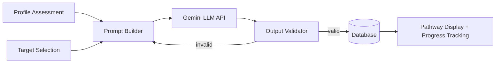

# LINGKUP

**Lingua & Karier Support Platform** — Platform berbasis AI untuk membantu mahasiswa Indonesia menyusun roadmap persiapan beasiswa internasional yang dipersonalisasi.

---

## Tentang Project

LINGKUP mengintegrasikan tiga komponen utama — **Profile Assessment**, **Target Selection**, dan **AI Pathway Generation** — menjadi satu pipeline personalisasi berbasis Large Language Model (Google Gemini). Sistem menghasilkan roadmap persiapan beasiswa multi-fase yang disesuaikan dengan profil akademik pengguna dan persyaratan target beasiswa yang dipilih.

Project ini dikembangkan sebagai **Tugas Akhir (TA)** program studi S1 Sistem Informasi, Telkom University Purwokerto, dan menjadi dasar artikel publikasi ilmiah pada proceeding terindeks Scopus.

**Penulis:** Muhammad Rafi Awallaisal (NIM 2311103134)
**Program Studi:** S1 Sistem Informasi — Telkom University Purwokerto

---

## Fitur Utama

### Untuk Pengguna (Mahasiswa)
- **Profile Assessment** — asesmen profil akademik, kemampuan bahasa, pengalaman, dan minat karier (13 field, 4 dimensi)
- **Target Selection** — katalog 8 target beasiswa internasional (MEXT, Chevening, AAS, Fulbright, DAAD, GKS, Erasmus+, LPDP)
- **AI Pathway Generation** — roadmap persiapan multi-fase yang dipersonalisasi, dibangkitkan via Gemini LLM
- **Progress Tracking** — checklist task per-fase dengan timeline visual, menampilkan fase yang sedang berjalan
- **Landing page & user home** — arsitektur hybrid (publik → home → dashboard kerja)

### Untuk Admin
- **Manajemen User** — list, suspend/aktifkan, ubah role, hapus (soft delete + restore)
- **Manajemen Target Beasiswa** — CRUD lengkap, toggle aktif/nonaktif, hapus (soft delete + restore) dengan guard integritas data
- **Manajemen Feedback** *(dalam pengembangan)*

---

## Tech Stack

| Komponen | Teknologi |
|---|---|
| Backend Framework | Laravel 12 |
| Bahasa Pemrograman | PHP 8.2 |
| Database | MySQL 8 |
| Frontend Template | Blade |
| CSS Framework | Bootstrap 5 (custom design tokens) |
| Build Tool | Vite |
| AI Provider | Google Gemini (via REST API) |
| Auth | Laravel Breeze |

---

## Arsitektur Pipeline



Setiap pathway tersimpan sebagai struktur hierarkis: **Pathway → Phases → Tasks**, dengan progress pengerjaan dilacak per-task per-user.

---

## Struktur Project

```
app/
├── Http/Controllers/
│   ├── Admin/              # UserController, TargetController, DashboardController
│   └── User/               # ProfileAssessmentController, TargetController,
│                            # PathwayController, ProgressController
├── Models/                 # User, Profile, Target, Pathway, PathwayPhase,
│                            # PathwayTask, TaskProgress, UserTarget, Feedback
├── Services/Pathway/        # PathwayGenerationService, PathwayRateLimiter
resources/
├── views/
│   ├── admin/               # users/, targets/
│   ├── user/                # progress/, pathway/, targets/
│   └── layouts/             # dashboard, landing
routes/web.php
database/migrations/
```

---

## Instalasi Lokal

### Prasyarat
- PHP 8.2+
- Composer
- Node.js & npm
- MySQL 8
- Google Gemini API Key ([dapatkan di sini](https://aistudio.google.com/app/apikey))

### Langkah Instalasi

```bash
# 1. Clone repository
git clone https://github.com/surthe49-hub/Lingkup.git
cd Lingkup

# 2. Install dependencies
composer install
npm install

# 3. Setup environment
cp .env.example .env
php artisan key:generate

# 4. Isi konfigurasi di .env — lihat bagian "Environment Variables" di bawah

# 5. Migrasi database + seeder
php artisan migrate --seed

# 6. Build asset frontend
npm run dev

# 7. Jalankan server
php artisan serve
```

Aplikasi dapat diakses di `http://127.0.0.1:8000`.

---

## Environment Variables Penting

Isi nilai berikut di file `.env` (**bukan** `.env.example`):

```env
DB_DATABASE=lingkup
DB_USERNAME=root
DB_PASSWORD=

GEMINI_API_KEY=your_actual_gemini_api_key
GEMINI_MODEL=gemini-1.5-flash-latest
GEMINI_API_TIMEOUT=30
```

> **Peringatan keamanan:** Jangan pernah mengisi API key asli di `.env.example` — file ini di-commit ke git dan bersifat publik. `.env.example` hanya boleh berisi placeholder (`your_api_key_here`). Key asli hanya boleh berada di `.env`, yang sudah ter-exclude lewat `.gitignore`.

---

## Status Pengembangan

| Fitur | Status |
|---|---|
| Profile Assessment | ✅ Selesai |
| Target Selection | ✅ Selesai |
| AI Pathway Generation | ✅ Selesai |
| Progress Tracking | ✅ Selesai |
| Landing Page & User Home | ✅ Selesai |
| Admin: Manajemen User | ✅ Selesai |
| Admin: Manajemen Target | ✅ Selesai |
| Admin: Manajemen Feedback | ⬜ Dalam pengembangan |
| Dokumentasi Teknis Lengkap | ⬜ Belum dimulai |
| Deployment Production | ⬜ Belum dimulai |

---

## Kontribusi

Project ini dikembangkan sebagai bagian dari Tugas Akhir individu. Bukan project open-source yang menerima kontribusi eksternal, namun pertanyaan atau diskusi seputar implementasi dapat diajukan lewat Issues.

---

## Lisensi

Project ini dibuat untuk keperluan akademik (Tugas Akhir & publikasi ilmiah). Hak cipta kode berada pada penulis.

---

## Kontak

**Muhammad Rafi Awallaisal**
S1 Sistem Informasi — Telkom University Purwokerto
NIM 2311103134
